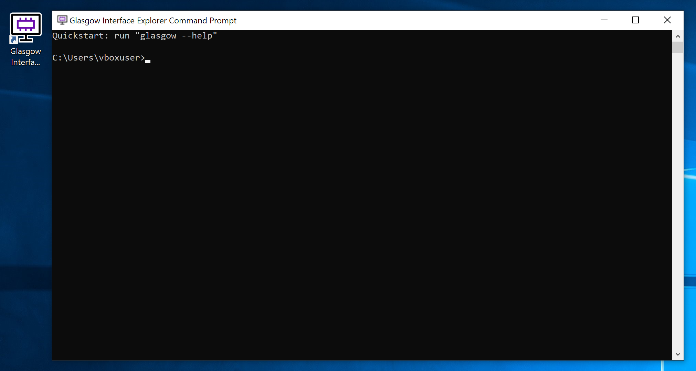
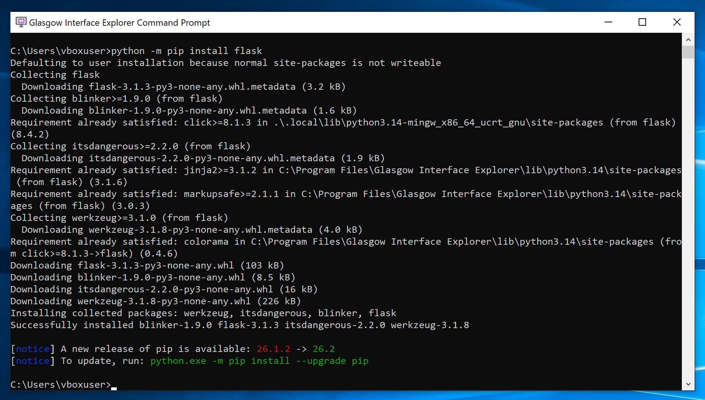

.. _install-binary:

Installing binary packages
==========================

At the moment, binary installers are built only for Microsoft Windows. Download and run the installer that matches your system by using the table below:

=========================================== ====== ========= ===============================================
Platform                                    Type   Size      Downloads
=========================================== ====== ========= ===============================================
Windows 7 SP1 [#f1]_ or newer (32 bit; x86) MSI    ~120 MB   `Worldwide <x86_msi_>`_, `China <x86_msi_cn_>`_
Windows 7 SP1 [#f1]_ or newer (64 bit; x64) MSI    ~120 MB   `Worldwide <x64_msi_>`_, `China <x64_msi_cn_>`_
=========================================== ====== ========= ===============================================

.. [#f1] In addition to Service Pack 1, use on Windows 7 requires `KB4457144`_ to be installed first.

.. _x86_msi: https://dl.glasgow-embedded.org/GlasgowInterfaceExplorer-x86.msi
.. _x64_msi: https://dl.glasgow-embedded.org/GlasgowInterfaceExplorer-x64.msi
.. _x86_msi_cn: https://dl.glasgow-embedded.cn/GlasgowInterfaceExplorer-x86.msi
.. _x64_msi_cn: https://dl.glasgow-embedded.cn/GlasgowInterfaceExplorer-x64.msi
.. _KB4457144: https://www.catalog.update.microsoft.com/Search.aspx?q=KB4457144

The installer is completely self-contained, includes every dependency required to use the Glasgow toolchain, and requires no network access, making it ideal for use with legacy or airgapped equipment. It installs the toolchain for all users on the machine.

Once the installation is complete, invoke the "Glasgow Interface Explorer" shortcut on your desktop, or open the start menu folder with the same name and click on the "Launch terminal" item. This should open a terminal window, as illustrated below:

Plug in your device and confirm that it is discovered by running the ``glasgow list`` command:

.. code:: doscon

    > glasgow list
    C3-20230729T201611Z

If you need to update the installation in the future, download and run a newer version of the installer. It will automatically remove the existing installation and replace it with the new one.

Installing Python packages
--------------------------

The binary installer includes an up-to-date build of the `Python`_ programming language that the Glasgow software is implemented in. The ``python`` command is available in the Glasgow command prompt and may be used for scripting or experimentation. It is also possible to install additional Python packages from `PyPI`_ using `Pip`_, the Python package manager.

To do this, run Pip using the ``python -m pip install ...`` command, for example:

.. _python: https://www.python.org/downloads/source/
.. _pypi: https://pypi.org/
.. _pip: https://pip.pypa.io/

Packages installed in this way are stored in ``%USERPROFILE%\.local``, and are preserved when the Glasgow toolchain is reinstalled or removed.

.. warning::

    In order to provide up-to-date builds of these binary packages and support as wide a range of Windows versions as feasible, we have built Python using the MinGW toolchain. Unfortunately, precompiled binary packages on PyPI are built using the incompatible MSVC toolchain, which means that some popular Python packages like ``numpy`` cannot be installed in the Glasgow command prompt.

    If you need to install additional packages with binary extensions on Windows, :ref:`install the toolchain from source <install-source>` instead.
