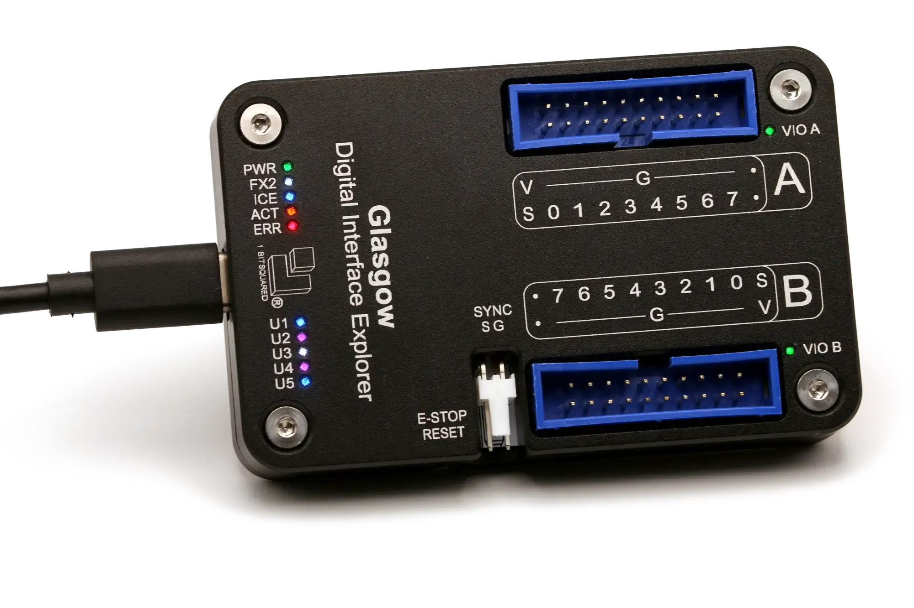

..
    These meta tags only affect direct fetches of https://glasgow-embedded.org/latest/.
    The landing page at https://glasgow-embedded.org/ is created in the GitHub Actions workflow and
    must be maintained manually (by copying these tags from the HTML source, probably).

.. meta::

    :og:title: Glasgow Interface Explorer
    :og:type: website
    :og:url: https://glasgow-embedded.org/
    :og:description: A highly capable and extremely flexible open source multitool for digital electronics
    :og:image: https://www.crowdsupply.com/img/f9a9/glasgow-revc2_jpg_open-graph.jpg
    :og:image:alt: A Glasgow Interface Explorer PCB, without a case

    :twitter:title: Glasgow Interface Explorer
    :twitter:card: summary_large_image
    :twitter:description: A highly capable and extremely flexible open source multitool for digital electronics
    :twitter:image: https://www.crowdsupply.com/img/f9a9/glasgow-revc2_jpg_project-main.jpg
    :twitter:image:alt: A Glasgow Interface Explorer PCB, without a case

Introduction
============

What is Glasgow?
----------------

Glasgow Interface Explorer is a tool for exploring digital interfaces, aimed at embedded developers, reverse engineers, digital archivists, electronics hobbyists, and everyone else who wants to communicate with a wide range of digital devices with high reliability and minimum hassle. It can be connected to most digital interfaces without additional active or passive components, and includes extensive protection from unexpected conditions and operator error.

The Glasgow hardware can support many digital interfaces because it uses reconfigurable logic. Instead of only offering a small selection of standard hardware supported interfaces, it uses an FPGA to adapt on the fly to the task at hand without compromising on performance or reliability, even for unusual, custom, or obsolete interfaces.

The Glasgow software is a set of building blocks designed to eliminate incidental complexity. Each interface is packaged into a self-contained applet that can be used directly from the command line, or reused as a part of a more complex system. Using Glasgow does not require any programming knowledge, although it becomes much more powerful if you know a bit of Python.

.. image:: ./_images/glasgow-pcba.webp
    :alt: Bare Glasgow Interface Explorer PCB assembly

What can I do with Glasgow?
---------------------------

* communicate via UART

  * automatically determine and follow the baud rate of device under test

* initiate transactions via SPI or I²C

* read and write 24-series I²C EEPROMs

* read and write 25-series SPI Flash memories

  * determine memory parameters via SFDP

* read and write ONFI-compatible Flash memories

  * determine memory parameters via ONFI parameter page

* read and write parallel 27/28/29-series EPROMs, EEPROMs and Flash memories

  * determine the extent of floating gate charge decay and rescue data

* program and verify AVR microcontrollers with SPI interface

* automatically determine unknown JTAG pinout

* play back JTAG SVF files

* debug ARC processors via JTAG

* debug some MIPS processors via EJTAG

* program and verify XC9500XL CPLDs via JTAG

* communicate using nRF24L01(+) radios

* program nRF24LE1 and nRF24LU1(+) microcontrollers

* synthesize sound using a Yamaha OPLx/OPM chip and play it in real time on a webpage

* read raw modulated data from 5.25"/3.5" floppy drives

* ... and more!

Everything above can be done with only a Glasgow revC board, some wires, and depending on the device under test, external power.

What does using Glasgow look like?
----------------------------------

This screencast shows a typical command-line workflow:

.. image:: https://asciinema.org/a/i9edqaUBVLLw7mRZCpdxe91Fu.svg
   :target: https://asciinema.org/a/245309

What software does Glasgow use?
-------------------------------

Glasgow is written entirely in `Python 3`_. The interface logic that runs on the FPGA is described using `Amaranth`_, which is a Python-based domain specific language. The supporting code that runs on the host PC is written in Python with `asyncio`_. This way, the logic on the FPGA can be assembled on demand for any requested configuration, keeping it as fast and compact as possible, and code can be shared between gateware and software, removing the need to add error-prone "glue" boilerplate.

Glasgow would not be possible without the `open-source iCE40 FPGA toolchain <icestorm_>`__, which is not only very reliable but also extremely fast. It is so fast that it usually only takes a few seconds to build a bitstream from scratch for something like a UART. When developing a new applet it is rarely necessary to wait for the toolchain to finish.

Implementing reliable, high-performance USB communication is not trivial—packetization, buffering, and USB quirks add up. Glasgow abstracts away USB: on the FPGA, the applet gateware writes to or reads from a FIFO, and on the host, applet software writes to or reads from a socket-like interface. Idiomatic Python code can communicate at maximum USB 2 bulk bandwidth on a modern PC without additional effort. Moreover, when a future Glasgow revision adds Ethernet next to USB, no changes to applet code will be necessary.

Debugging applets can be hard, especially if bidirectional communication over the same wires is involved. Glasgow provides a built-in cycle-accurate logic analyzer that can relate the I/O pin level and direction changes to commands and responses received and sent by the applet. The logic analyzer compresses waveforms and can pause the applet if its buffer is about to overflow.

.. _Python 3: https://www.python.org/
.. _Amaranth: https://github.com/amaranth-lang/amaranth/
.. _asyncio: https://docs.python.org/3/library/asyncio.html
.. _icestorm: https://github.com/YosysHQ/icestorm