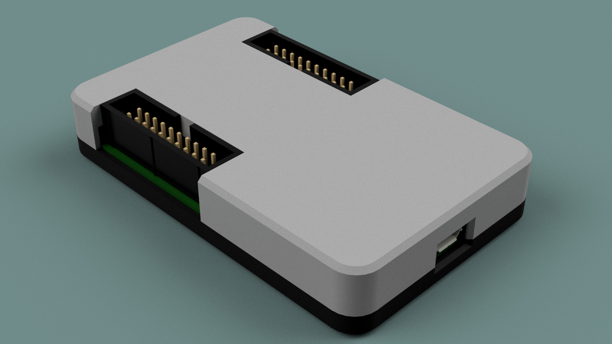

# Magnetic 3D Printed Case Lid
This lid is based off and works with the `3d-printed-base` also in this repository. It is primarily intended to protect the Glasgow in storage or travel, but allows for use of the 2.54mm headers and features open sides to allow the lid to be taken on and off without disconnecting any cables.

It is designed to be a decent friction fit, and to also have 5 x 2mm magnets glued in the recesses above the glasgow's mounting holes to provide some force to keep the lid in place.

This lid was designed for and tested with a revC1, but should be easily modified for future revisions. STL and IGES files are provided, and the `.f3z` contains a complete Fusion 360 archive of the design (based on the file in the `3d-printed-base` directory).

