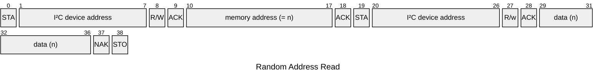
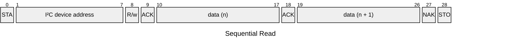

# 24-series I²C EEPROM emulation applet

Emulates the read and write operations of a generic 24-series I²C EEPROM. The memory size, address width, and initial contents can be chosen at build time.

Operations besides read and write operations no further operations are implemented. Reads and writes are not paged and may be performed in arbitrarily sized batches (reads only or writes only). Paging reliant behavior like writes/reads wrapping around to the start of a page when the end of a page is reached in an operation is not supported. All reads and writes will always access the current address, wrapping around only once the end of the memory is reached.

<!--
    TODO: packet diagrams are not flexible enough
          START/STOP are not really normal bits
          can't have a discontinuous section
-->

## Random Address Read
During a random address read the I²C initiator sends a start strobe initiating a write and writes as many bytes as the chosen address width. This is followed by a restart strobe initiating a read. This read will return the byte from the selected address.

Deviating from I²C devices, the initiator may follow up with further reads. Each read will increment the address being read from. See [Sequential Read](#sequential-read)

## Sequential Read
During a sequential read, the initiator sends a start strobe initiating a read. The read will return the byte in memory stored at the current address. This may be followed by as many further reads as desired. Each read increments the current address, i.e. consecutive reads will read bytes sequentially from memory.

